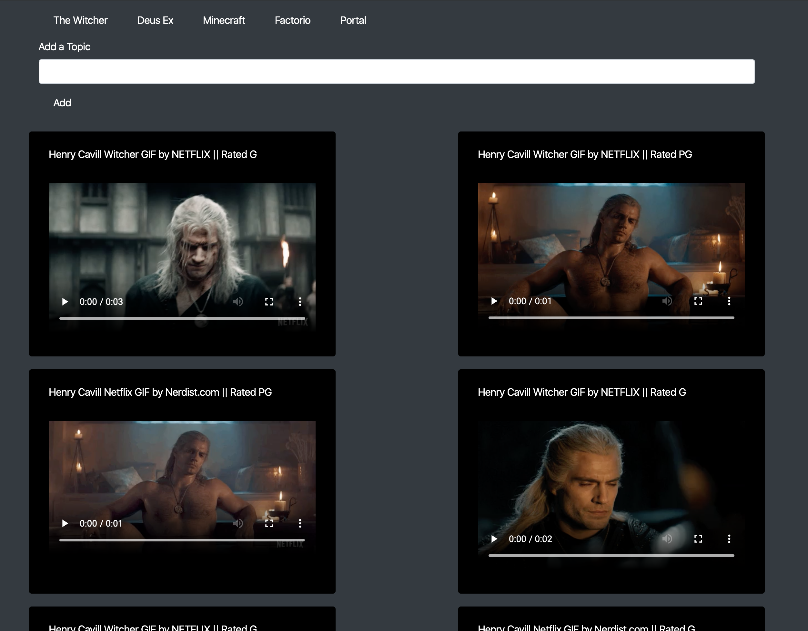

# GifTastic

## Easy Giphy Viewing
Using GifTastic you are able to create topic buttons.  When clicking said buttons you are shown a list of 10 gifs taken from Giphy that correlate to the topic.  Each time you press the button, a new set of 10 gifs is generated until there are no more relating to that topic.

## Demo:

Try it out here: https://bradleyknutson.github.io/GifTastic/

## Frameworks Used:
* jQuery 
* Giphy API
* Bootstrap
* Vanilla HTML, CSS, Javascript

## Working Improvements:
* Add favorites section that adds the gif to local storage
* Integrate other API calls based upon the topic of the button or type of Gif